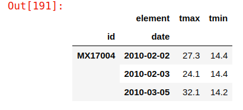

# Dataset contains min and max weather temperatures for certain days. 
See desirable output in figure below.




```python
import datetime

import pandas as pd
```

### Tips:

1) use datetime.datetime

2) use pivot_table in the end


```python
df = pd.read_csv("weather-raw.csv")
df['id'] = df['id'].str.strip()
df = df.melt(id_vars=['id', 'year', 'month', 'element'])
```


```python
df['date'] = df['year'].astype('str') + '-' + df['month'].astype(
    'str') + '-' + df['variable'].str.replace('d', '')
df['date'] = pd.to_datetime(df['date'])
```


```python
df = pd.pivot_table(df,
                    values=['value'],
                    columns=['element'],
                    index=['id', 'date'])
```


```python
df = df.droplevel(level=0, axis=1)
df['tmin'] = df['tmin'].ffill().dropna()
df['tmax'] = df['tmax'].bfill()
```


```python
df
```


<div>
<style scoped>
    .dataframe tbody tr th:only-of-type {
        vertical-align: middle;
    }

    .dataframe tbody tr th {
        vertical-align: top;
    }

    .dataframe thead th {
        text-align: right;
    }
</style>
<table border="1" class="dataframe">
  <thead>
    <tr style="text-align: right;">
      <th></th>
      <th>element</th>
      <th>tmax</th>
      <th>tmin</th>
    </tr>
    <tr>
      <th>id</th>
      <th>date</th>
      <th></th>
      <th></th>
    </tr>
  </thead>
  <tbody>
    <tr>
      <th rowspan="3" valign="top">MX17004</th>
      <th>2010-02-02</th>
      <td>27.3</td>
      <td>14.4</td>
    </tr>
    <tr>
      <th>2010-02-03</th>
      <td>24.1</td>
      <td>14.4</td>
    </tr>
    <tr>
      <th>2010-03-05</th>
      <td>32.1</td>
      <td>14.2</td>
    </tr>
  </tbody>
</table>
</div>


