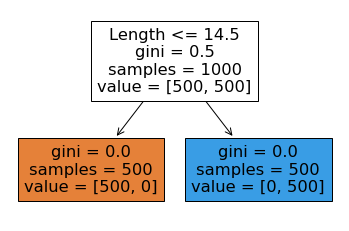
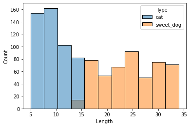

```python
import pandas as pd
from sklearn.tree import DecisionTreeClassifier, plot_tree
from sklearn.model_selection import cross_val_score
from collections import Counter
import seaborn as sns
```


```python
train = pd.read_csv('dogs_n_cats.csv').sample(frac=1)
test = pd.read_json('a.json')
```


```python
train.Type.value_counts(normalize=True)
```


    sweet_dog    0.5
    cat          0.5
    Name: Type, dtype: float64


```python
train.head()
```


<div>
<style scoped>
    .dataframe tbody tr th:only-of-type {
        vertical-align: middle;
    }

    .dataframe tbody tr th {
        vertical-align: top;
    }

    .dataframe thead th {
        text-align: right;
    }
</style>
<table border="1" class="dataframe">
  <thead>
    <tr style="text-align: right;">
      <th></th>
      <th>Length</th>
      <th>Height</th>
      <th>Fur</th>
      <th>Bark</th>
      <th>Climb</th>
      <th>Type</th>
    </tr>
  </thead>
  <tbody>
    <tr>
      <th>595</th>
      <td>13</td>
      <td>5.2</td>
      <td>1</td>
      <td>0</td>
      <td>1</td>
      <td>cat</td>
    </tr>
    <tr>
      <th>335</th>
      <td>26</td>
      <td>31.2</td>
      <td>1</td>
      <td>1</td>
      <td>0</td>
      <td>sweet_dog</td>
    </tr>
    <tr>
      <th>5</th>
      <td>26</td>
      <td>31.2</td>
      <td>1</td>
      <td>0</td>
      <td>0</td>
      <td>sweet_dog</td>
    </tr>
    <tr>
      <th>475</th>
      <td>26</td>
      <td>31.2</td>
      <td>1</td>
      <td>1</td>
      <td>0</td>
      <td>sweet_dog</td>
    </tr>
    <tr>
      <th>225</th>
      <td>29</td>
      <td>34.8</td>
      <td>1</td>
      <td>1</td>
      <td>0</td>
      <td>sweet_dog</td>
    </tr>
  </tbody>
</table>
</div>


```python
test.head()
```


<div>
<style scoped>
    .dataframe tbody tr th:only-of-type {
        vertical-align: middle;
    }

    .dataframe tbody tr th {
        vertical-align: top;
    }

    .dataframe thead th {
        text-align: right;
    }
</style>
<table border="1" class="dataframe">
  <thead>
    <tr style="text-align: right;">
      <th></th>
      <th>Length</th>
      <th>Height</th>
      <th>Fur</th>
      <th>Bark</th>
      <th>Climb</th>
    </tr>
  </thead>
  <tbody>
    <tr>
      <th>0</th>
      <td>25</td>
      <td>30.0</td>
      <td>1</td>
      <td>1</td>
      <td>0</td>
    </tr>
    <tr>
      <th>1</th>
      <td>34</td>
      <td>40.8</td>
      <td>1</td>
      <td>1</td>
      <td>0</td>
    </tr>
    <tr>
      <th>2</th>
      <td>33</td>
      <td>39.6</td>
      <td>1</td>
      <td>1</td>
      <td>0</td>
    </tr>
    <tr>
      <th>3</th>
      <td>34</td>
      <td>40.8</td>
      <td>1</td>
      <td>1</td>
      <td>0</td>
    </tr>
    <tr>
      <th>4</th>
      <td>28</td>
      <td>33.6</td>
      <td>1</td>
      <td>1</td>
      <td>0</td>
    </tr>
  </tbody>
</table>
</div>


```python
cross_val_score(DecisionTreeClassifier(random_state=12), train.drop('Type', axis = 1), train.Type, cv=3, scoring='accuracy')
```


    array([1., 1., 1.])


```python
dt = DecisionTreeClassifier(random_state=12).fit(train.drop('Type', axis = 1), train.Type)
```


```python
plot_tree(dt, filled=True, feature_names=list(train.drop('Type', axis = 1)));
```


    

    


```python
sns.histplot(train, x='Length', hue='Type', alpha = 0.5);
```


    

    


# В тесте:


```python
Counter(dt.predict(test))
```


    Counter({'sweet_dog': 46, 'cat': 54})


