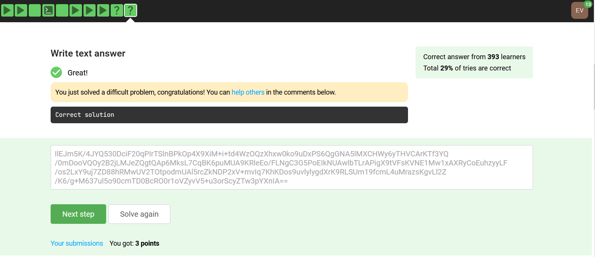

[Stepik 1](https://stepik.org/lesson/35912/step/10?auth=login&unit=15067)

*On Windows :*

```
> Virtual environment creation :
virtualenv docker_and_snakemake
docker_and_snakemake\Scripts\activate
pip install snakemake
pip install graphviz
```
---
```
> Snakefile content:
def count(x): return len(x.split())

rule all:
    output: 'output/output'
    input: 'input/input'
    run:
        open(output[0], 'w').write(str(count(open(input[0], 'r').read())))
```
---
```
> Building graph :
snakemake --snakefile Snakefile --rulegraph | dot -Tpdf > dag.pdf // Large ALL whole over the screen
```
---
```
> Run Docker container from Stepik exercise :
SET pwd=%cd%
docker run --rm -v %pwd%/Snakefile:/mnt/Snakefile parseq/stepik-word-count-snakemake
```
---
```
> Resulted code :
IlEJm5K/4JYQ530DciF20qPIrTSlnBPkOp4X9XiM+i+td4WzOQzXhxw0ko9uDxPS6QgGNA5lMXCHWy6yTHVCArKTf3YQ/0mDooVQOy2B2jLMJeZQgtQAp6MksL7CqBK6puMUA9KRleEo/FLNgC3G5PoEIkNUAwlbTLrAPigX9tVFsKVNE1Mw1xAXRyCoEuhzyyLF/os2LxY9uj7ZD88hRMwUV2TOtpodmUAl5rcZkNDP2xV+mvIq7KhKDos9uvlylygdXrK9RLSUm19fcmL4uMrazsKgvLl2Z/K6/g+M637ul5o90cmTD0BcRO0r1oVZyvV5+u3orScyZTw3pYXnIA==
```
---


---
---
[Stepik 2](https://stepik.org/lesson/35914/step/6?unit=15065)

*On Windows :*

```
> Snakefile content:

import os
from collections import Counter

INPUT = [f'input/{file}' for file in os.listdir('input') if file[0] != '.']
OUTPUT = [f"output/{file.split('/')[1]}" for file in INPUT]


if not os.path.exists('output'):
    os.makedirs('output')

rule all:
    input: OUTPUT
    output: ".status"
    shell: "dir > {output}"

rule count:
    input: "input/{file}"
    output: "output/{file}"
    run:
        for i, o in zip(input, output):
            i = open(i, 'r').read().lower().replace(
                ' ', '').replace('.', '').replace('\n', '')
            cnt = Counter(list(i)).most_common()
            cnt = [(c[0], c[1]) for c in cnt]
            cnt.sort(key=lambda x: x[0])
            with open(o, 'w') as out:
                for item in cnt:
                    out.write(f"{item[0]}: {item[1]}\n")
```
---
```
> Run Docker container from Stepik exercise :
SET pwd=%cd%
docker run --rm -v %cd%/Snakefile:/mnt/Snakefile parseq/stepik-python-in-snakemake
```
---
```
> Result (it is ok,  but stepik does not like it)
Building DAG of jobs...
Provided cores: 1 (use --cores to define parallelism)
Rules claiming more threads will be scaled down.
Job counts:
        count   jobs
        1       all
        2       count
        3

[Mon Jun  7 12:55:22 2021]
rule count:
    input: input/2 - Copy.txt
    output: output/2 - Copy.txt
    jobid: 1
    wildcards: file=2 - Copy.txt

[Mon Jun  7 12:55:22 2021]
Finished job 1.
1 of 3 steps (33%) done

[Mon Jun  7 12:55:22 2021]
rule count:
    input: input/2.txt
    output: output/2.txt
    jobid: 2
    wildcards: file=2.txt

[Mon Jun  7 12:55:22 2021]
Finished job 2.
2 of 3 steps (67%) done

[Mon Jun  7 12:55:22 2021]
rule all:
    input: output/2 - Copy.txt, output/2.txt
    output: .status
    jobid: 0

[Mon Jun  7 12:55:23 2021]
Finished job 0.
3 of 3 steps (100%) done
Complete log: A:\BI\2\SP\Docker_Snakemake\2\.snakemake\log\2021-06-07T125522.828790.snakemake.log
```

---

```
abcabcacbdefabc
>
a: 4
b: 4
c: 4
d: 1
e: 1
f: 1
```
