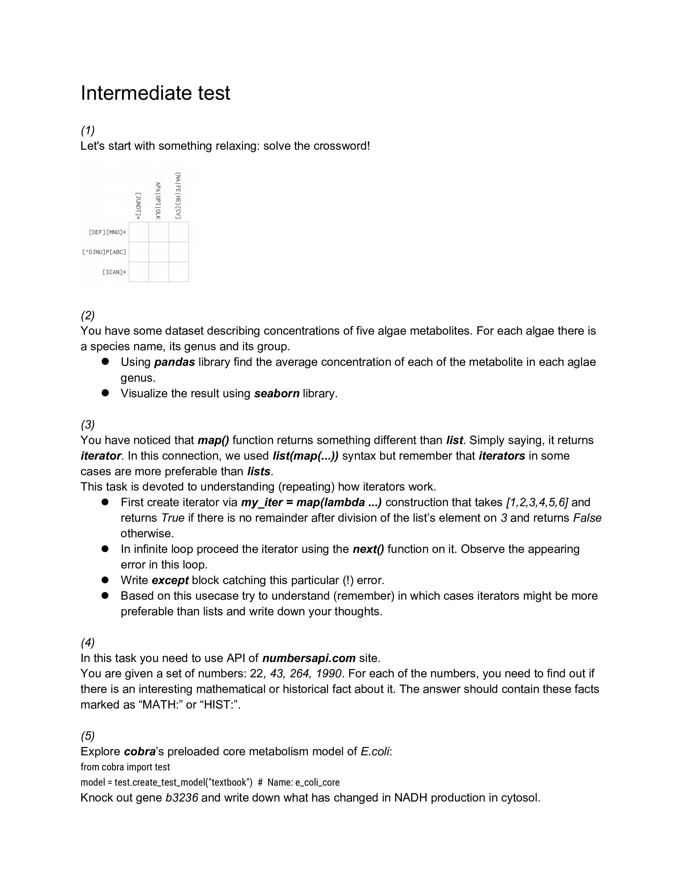
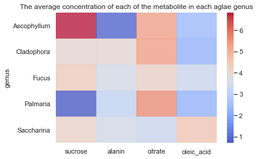

```python
import pandas as pd
import seaborn as sns
import matplotlib.pyplot as plt
import requests
import time 
sns.set()
```


```python
from wand.image import Image as WImage
WImage(filename='Test.pdf', resolution=300)
```





# 1 crossword

```
---|---|---
D  | O |  N
---|---|---
T  | P |  A
---|---|---
N  | I |  C
---|---|---
```

# 2 algae metabolites


```python
algae = pd.read_csv('data_for_task2.csv')
algae.head(2)
```


<div>
<style scoped>
    .dataframe tbody tr th:only-of-type {
        vertical-align: middle;
    }

    .dataframe tbody tr th {
        vertical-align: top;
    }

    .dataframe thead th {
        text-align: right;
    }
</style>
<table border="1" class="dataframe">
  <thead>
    <tr style="text-align: right;">
      <th></th>
      <th>species</th>
      <th>genus</th>
      <th>group</th>
      <th>sucrose</th>
      <th>alanin</th>
      <th>citrate</th>
      <th>glucose</th>
      <th>oleic_acid</th>
    </tr>
  </thead>
  <tbody>
    <tr>
      <th>0</th>
      <td>Fucus_vesiculosus</td>
      <td>Fucus</td>
      <td>brown</td>
      <td>3.001472</td>
      <td>3.711498</td>
      <td>5.004262</td>
      <td>2.548459</td>
      <td>6.405165</td>
    </tr>
    <tr>
      <th>1</th>
      <td>Saccharina_japonica</td>
      <td>Saccharina</td>
      <td>brown</td>
      <td>6.731070</td>
      <td>1.255251</td>
      <td>5.621499</td>
      <td>6.013219</td>
      <td>4.156700</td>
    </tr>
  </tbody>
</table>
</div>


```python
algae.groupby('genus')[['sucrose','alanin','citrate','oleic_acid']].mean()
```


<div>
<style scoped>
    .dataframe tbody tr th:only-of-type {
        vertical-align: middle;
    }

    .dataframe tbody tr th {
        vertical-align: top;
    }

    .dataframe thead th {
        text-align: right;
    }
</style>
<table border="1" class="dataframe">
  <thead>
    <tr style="text-align: right;">
      <th></th>
      <th>sucrose</th>
      <th>alanin</th>
      <th>citrate</th>
      <th>oleic_acid</th>
    </tr>
    <tr>
      <th>genus</th>
      <th></th>
      <th></th>
      <th></th>
      <th></th>
    </tr>
  </thead>
  <tbody>
    <tr>
      <th>Ascophyllum</th>
      <td>6.825467</td>
      <td>0.875429</td>
      <td>5.253527</td>
      <td>2.432526</td>
    </tr>
    <tr>
      <th>Cladophora</th>
      <td>4.008792</td>
      <td>3.997055</td>
      <td>5.288311</td>
      <td>2.263472</td>
    </tr>
    <tr>
      <th>Fucus</th>
      <td>4.355112</td>
      <td>3.566411</td>
      <td>4.214878</td>
      <td>3.367647</td>
    </tr>
    <tr>
      <th>Palmaria</th>
      <td>0.704580</td>
      <td>3.176440</td>
      <td>5.573905</td>
      <td>2.245538</td>
    </tr>
    <tr>
      <th>Saccharina</th>
      <td>4.183596</td>
      <td>3.524207</td>
      <td>3.346710</td>
      <td>4.487252</td>
    </tr>
  </tbody>
</table>
</div>


```python
sns.heatmap(algae.groupby('genus')[['sucrose', 'alanin', 'citrate','oleic_acid']].mean(),
            alpha=0.7,
            square=False,
            cmap="coolwarm")

plt.title('The average concentration of each of the metabolite in each aglae genus');
```





# 3 iterator

The use of iterators is useful in this case, as they remember their state and can save memory in the future.


```python
my_iter = map(lambda x: x % 3 == 0, [1, 2, 3, 4, 5, 6])

while True:
    try:
        print(next(my_iter))
    except StopIteration:
        break
```

    False
    False
    True
    False
    False
    True
    

# 4 Numbersapi

n this task you need to use API of numbersapi.com site.
You are given a set of numbers: 22, 43, 264, 1990. For each of the numbers, you need to find out if 
there is an interesting mathematical or historical fact about it. The answer should contain these facts 
marked as “MATH:” or “HIST:”


```python
nums = [22, 43, 264, 1990]
'''
Hypothesis: the longer the fact, the more interesting it is

'''

for n in nums:
    time.sleep(3)

    fmath = requests.get(f"http://numbersapi.com/{n}/math?default=Nothing")
    fmath = fmath.text if (fmath.status_code == 200
                           and str(n) in fmath.text) else ''

    fdate = requests.get(f"http://numbersapi.com/{n}/date?default=Nothing")
    fdate = fdate.text if (fdate.status_code == 200
                           and str(n) in fdate.text) else ''

    fyear = requests.get(f"http://numbersapi.com/{n}/year?default=Nothing")
    fyear = fyear.text if (fyear.status_code == 200
                           and str(n) in fyear.text) else ''

    content = [('MATH', len(fmath), fmath), ('HIST', len(fdate), fdate),
               ('HIST', len(fyear), fyear)]
    content.sort(key=lambda x: x[1])

    print(f'for {n}:\n{content[-1][0]}: {content[-1][2]}\n_ _ _ _ _ _\n')
```

    for 22:
    HIST: January 22nd is the day in 1506 that the first contingent of 150 Swiss Guards arrives at the Vatican.
    _ _ _ _ _ _
    
    for 43:
    HIST: 43 is the year that the warrior Trung Sisters commit suicide after their resistance is defeated at Nam Viet in Vietnam.
    _ _ _ _ _ _
    
    for 264:
    HIST: 264 is the year that Sun Hao succeeds Sun Xiu as ruler of the Chinese Kingdom of Wu.
    _ _ _ _ _ _
    
    for 1990:
    HIST: 1990 is the year that Lech Wałęsa and Stanisław Tymiński win the first round of the first presidential elections in Poland on November 25th.
    _ _ _ _ _ _
    
    

# 5 Cobra

Cytosolic NADH production has increased with knockout of b3236 gene


```python
from cobra import test
model = test.create_test_model("textbook")
```


```python
model.optimize()
model.summary()
```


<h3>Objective</h3><p>1.0 Biomass_Ecoli_core = 0.8739215069684306</p><h4>Uptake</h4><table border="1" class="dataframe">
  <thead>
    <tr style="text-align: right;">
      <th>Metabolite</th>
      <th>Reaction</th>
      <th>Flux</th>
      <th>C-Number</th>
      <th>C-Flux</th>
    </tr>
  </thead>
  <tbody>
    <tr>
      <td>glc__D_e</td>
      <td>EX_glc__D_e</td>
      <td>10</td>
      <td>6</td>
      <td>100.00%</td>
    </tr>
    <tr>
      <td>nh4_e</td>
      <td>EX_nh4_e</td>
      <td>4.765</td>
      <td>0</td>
      <td>0.00%</td>
    </tr>
    <tr>
      <td>o2_e</td>
      <td>EX_o2_e</td>
      <td>21.8</td>
      <td>0</td>
      <td>0.00%</td>
    </tr>
    <tr>
      <td>pi_e</td>
      <td>EX_pi_e</td>
      <td>3.215</td>
      <td>0</td>
      <td>0.00%</td>
    </tr>
  </tbody>
</table><h4>Secretion</h4><table border="1" class="dataframe">
  <thead>
    <tr style="text-align: right;">
      <th>Metabolite</th>
      <th>Reaction</th>
      <th>Flux</th>
      <th>C-Number</th>
      <th>C-Flux</th>
    </tr>
  </thead>
  <tbody>
    <tr>
      <td>co2_e</td>
      <td>EX_co2_e</td>
      <td>-22.81</td>
      <td>1</td>
      <td>100.00%</td>
    </tr>
    <tr>
      <td>h2o_e</td>
      <td>EX_h2o_e</td>
      <td>-29.18</td>
      <td>0</td>
      <td>0.00%</td>
    </tr>
    <tr>
      <td>h_e</td>
      <td>EX_h_e</td>
      <td>-17.53</td>
      <td>0</td>
      <td>0.00%</td>
    </tr>
  </tbody>
</table>


```python
model.metabolites.nadh_c.summary().producing_flux.flux.sum()
```


    38.53460965051541


```python
model.genes.b3236.knock_out()
model.optimize()
```


<strong><em>Optimal</em> solution with objective value 0.826</strong><br><div>
<style scoped>
    .dataframe tbody tr th:only-of-type {
        vertical-align: middle;
    }

    .dataframe tbody tr th {
        vertical-align: top;
    }

    .dataframe thead th {
        text-align: right;
    }
</style>
<table border="1" class="dataframe">
  <thead>
    <tr style="text-align: right;">
      <th></th>
      <th>fluxes</th>
      <th>reduced_costs</th>
    </tr>
  </thead>
  <tbody>
    <tr>
      <th>ACALD</th>
      <td>0.000000e+00</td>
      <td>-1.075529e-16</td>
    </tr>
    <tr>
      <th>ACALDt</th>
      <td>0.000000e+00</td>
      <td>0.000000e+00</td>
    </tr>
    <tr>
      <th>ACKr</th>
      <td>-8.275306e-31</td>
      <td>-8.673617e-18</td>
    </tr>
    <tr>
      <th>ACONTa</th>
      <td>8.339762e+00</td>
      <td>0.000000e+00</td>
    </tr>
    <tr>
      <th>ACONTb</th>
      <td>8.339762e+00</td>
      <td>0.000000e+00</td>
    </tr>
    <tr>
      <th>...</th>
      <td>...</td>
      <td>...</td>
    </tr>
    <tr>
      <th>TALA</th>
      <td>-1.477391e-01</td>
      <td>-1.387779e-17</td>
    </tr>
    <tr>
      <th>THD2</th>
      <td>0.000000e+00</td>
      <td>-6.045087e-03</td>
    </tr>
    <tr>
      <th>TKT1</th>
      <td>-1.477391e-01</td>
      <td>-0.000000e+00</td>
    </tr>
    <tr>
      <th>TKT2</th>
      <td>-4.458598e-01</td>
      <td>-1.110223e-16</td>
    </tr>
    <tr>
      <th>TPI</th>
      <td>9.178558e+00</td>
      <td>0.000000e+00</td>
    </tr>
  </tbody>
</table>
<p>95 rows × 2 columns</p>
</div>


```python
model.metabolites.nadh_c.summary()
```


<h3>nadh_c</h3><p>C21H27N7O14P2</p><h4>Producing Reactions</h4><table border="1" class="dataframe">
  <thead>
    <tr style="text-align: right;">
      <th>Percent</th>
      <th>Flux</th>
      <th>Reaction</th>
      <th>Definition</th>
    </tr>
  </thead>
  <tbody>
    <tr>
      <td>18.46%</td>
      <td>7.449</td>
      <td>AKGDH</td>
      <td>akg_c + coa_c + nad_c --&gt; co2_c + nadh_c + succoa_c</td>
    </tr>
    <tr>
      <td>7.26%</td>
      <td>2.929</td>
      <td>Biomass_Ecoli_core</td>
      <td>1.496 3pg_c + 3.7478 accoa_c + 59.81 atp_c + 0.361 e4p_c + 0.0709 f6p_c + 0.129 g3p_c + 0.205 g6p_c + 0.2557 gln__L_c + 4.9414 glu__L_c + 59.81 h2o_c + 3.547 nad_c + 13.0279 nadph_c + 1.7867 oaa_c + 0.5191 pep_c + 2.8328 pyr_c + 0.8977 r5p_c --&gt; 59.81 adp_c + 4.1182 akg_c + 3.7478 coa_c + 59.81 h_c + 3.547 nadh_c + 13.0279 nadp_c + 59.81 pi_c</td>
    </tr>
    <tr>
      <td>44.12%</td>
      <td>17.8</td>
      <td>GAPD</td>
      <td>g3p_c + nad_c + pi_c &lt;=&gt; 13dpg_c + h_c + nadh_c</td>
    </tr>
    <tr>
      <td>1.83%</td>
      <td>0.738</td>
      <td>ME1</td>
      <td>mal__L_c + nad_c --&gt; co2_c + nadh_c + pyr_c</td>
    </tr>
    <tr>
      <td>28.34%</td>
      <td>11.43</td>
      <td>PDH</td>
      <td>coa_c + nad_c + pyr_c --&gt; accoa_c + co2_c + nadh_c</td>
    </tr>
  </tbody>
</table><h4>Consuming Reactions</h4><table border="1" class="dataframe">
  <thead>
    <tr style="text-align: right;">
      <th>Percent</th>
      <th>Flux</th>
      <th>Reaction</th>
      <th>Definition</th>
    </tr>
  </thead>
  <tbody>
    <tr>
      <td>100.00%</td>
      <td>-40.36</td>
      <td>NADH16</td>
      <td>4.0 h_c + nadh_c + q8_c --&gt; 3.0 h_e + nad_c + q8h2_c</td>
    </tr>
  </tbody>
</table>


```python
model.metabolites.nadh_c.summary().producing_flux.flux.sum()
```


    40.35544948242236


